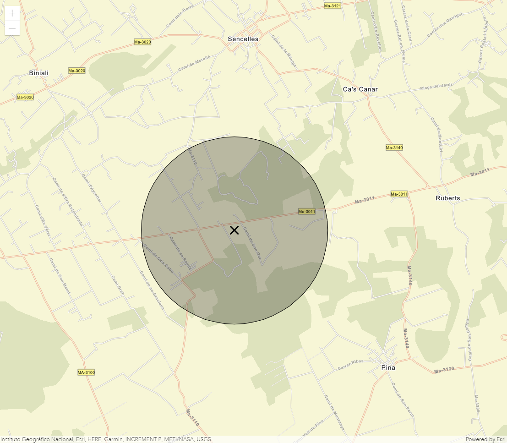

# Crear círculos


En este caso hemos creado una aplicación web que permite crear zonas de influencia a partir de un click. Concretamente, cada vez que seleccionamos un punto en el mapa creamos un círculo de 1,5 km de radio y seleccionamos tanto el punto marcado como el área en torno a él. 

Los [círculos](https://developers.arcgis.com/javascript/latest/api-reference/esri-geometry-Circle.html) son entidades gráficas por tanto, su creación e implementación es muy similar a la de las [geometrías de puntos, líneas y polígonos](https://github.com/esri-es/arcgis-devlabs/tree/master/APIJavaScript/graphicPoint). 

## Pasos
1. Capturar el click sobre la vista del mapa, que actuará como centro, y añadirlo sobre la capa gráfica que tiene por defecto la vista.
```js
view.on('click', function(evt) {
  const centerCircle = new Graphic({
    geometry: {
      type: 'point',
      longitude: evt.mapPoint.longitude,
      latitude: evt.mapPoint.latitude
    },
    symbol: { 
      type: "simple-marker", 
      style: "x", 
      outline: { 
        width: 2 
      } 
    }
  });

  view.graphics.add(centerCircle);
});
``` 
2. Crear el círculo a partir de esa localización. Tan solo hay que definir el centro, el radio y la unidad métrica. Como hemos hecho con el centro del punto, lo añadimos a la vista como un gráfico.
```js
var circle = new Circle({
  center: {
    x: evt.mapPoint.x,
    y: evt.mapPoint.y,
    spatialReference: evt.mapPoint.spatialReference.wkid
  },
  radius: 1500,
  radiusUnit: "meters"
});

view.graphics.add(circle);
```
<br>

### 💡 Quick Tip!

También podemos añadir el centro y la circuferencia a la vista utilizando el método *addMany* 
```js
  view.graphics.addMany([graphic, centroid]);
```