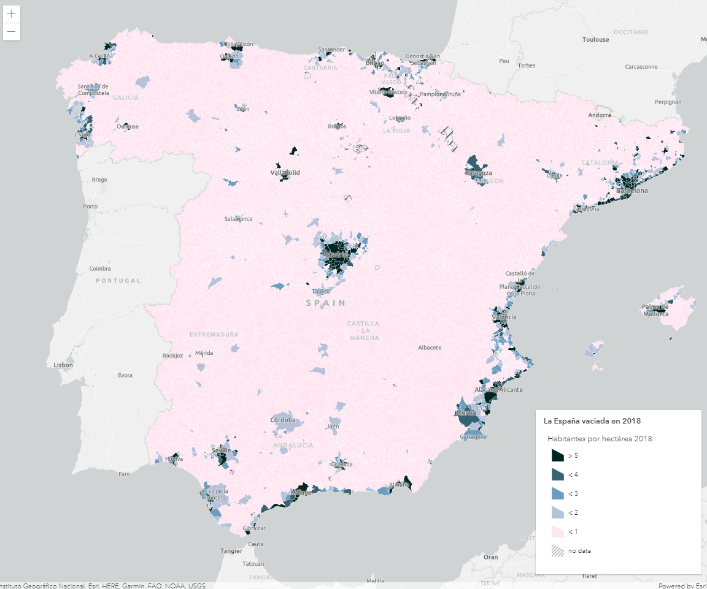

# Class Break Renderer



En este tutorial se implementa el uso de la clase [ClassBreakRenderer](https://developers.arcgis.com/javascript/latest/api-reference/esri-renderers-ClassBreaksRenderer.html) que nos permite asignar una simbología en función del valor del campo. 

Hemos utilizado los mismos datos y estilos del [tutorial de rampas de color](https://github.com/esri-es/arcgis-devlabs/tree/master/APIJavaScript/rampaColor) para que sea más fácil ver la diferencia. Y como se puede ver, la diferencia está en que ya no tenemos una gama de colores entre el valor máximo y mínimo sino que tenemos 5 colores concretos. 

## Pasos
1. Definición del mapa y su vista.
```js
const map = new Map({
  basemap: "gray-vector"
});

const view = new MapView({
  map: map,
  container: "viewDiv",
  center: [-3.690468, 40.402254],
  zoom: 6
});
```

2. Creamos la capa y la añadimos al mapa.
```js
const populationLayer = new FeatureLayer({
  url: "https://services1.arcgis.com/nCKYwcSONQTkPA4K/ArcGIS/rest/services/La_Espa%c3%b1a_despoblada/FeatureServer/0"
});

map.add(populationLayer);
```

3. El renderizado será de tipo *class-breaks* y el [campo](https://services1.arcgis.com/nCKYwcSONQTkPA4K/ArcGIS/rest/services/La_Espa%c3%b1a_despoblada/FeatureServer/0) que queremos representar es *HabHa*, es decir, número de habitantes por hectárea. A continuación, declaramos la simbología y etiqueta por defecto y, por último, **definimos los puntos de ruptura**, es decir, los puntos en los que pasaremos de una clase a otra dentro del array *classBreakInfos*. Para definir cada clase necesitaremos el valor mínimo, el máximo, su simbología y su etiqueta.
```js
const populationRenderer = {
  type: "class-breaks",
  field: "HabHa",
  defaultSymbol: populationDefaultSymbol,
  defaultLabel: "no data",
  classBreakInfos: [
    {
      minValue: 0,
      maxValue: 1,
      symbol: less1,
      label: "< 1"
    },
    {
      minValue: 1.00001,
      maxValue: 2,
      symbol: less2,
      label: "< 2"
    },
    {
      minValue: 2.00001,
      maxValue: 3,
      symbol: less3,
      label: "< 3"
    },
    {
      minValue: 3.00001,
      maxValue: 4,
      symbol: less4,
      label: "< 4"
    },
    {
      minValue: 4.0001,
      maxValue: 100,
      symbol: more5,
      label: "> 5"
    }
  ]
};
```
Previamente al renderizado tenemos que definir la simbología de la siguiente forma:
```js
const more5 = {
  type: "simple-fill",
  color: "#002624",
  style: "solid",
  outline: {
    width: 0.2,
    color: [255, 255, 255, 0.5]
  }
};

const populationDefaultSymbol = {
  type: "simple-fill",
  color: "black",
  style: "backward-diagonal",
  outline: {
    width: 0.1,
    color: [50, 50, 50, 0.6]
  }
};
```

4. Añadimos el renderizado a la capa.
```js
const populationLayer = new FeatureLayer({
  url: "https://services1.arcgis.com/nCKYwcSONQTkPA4K/ArcGIS/rest/services/La_Espa%c3%b1a_despoblada/FeatureServer/0",
  renderer: populationRenderer
});
```

5. Facilitaremos la lectura del mapa añadiendo una leyenda.
```js
view.ui.add(
  new Legend({
    view: view,
    layerInfos: [{
      layer: populationLayer,
      title: "La España vaciada en 2018"
    }]
  }),
  "bottom-right"
);
```