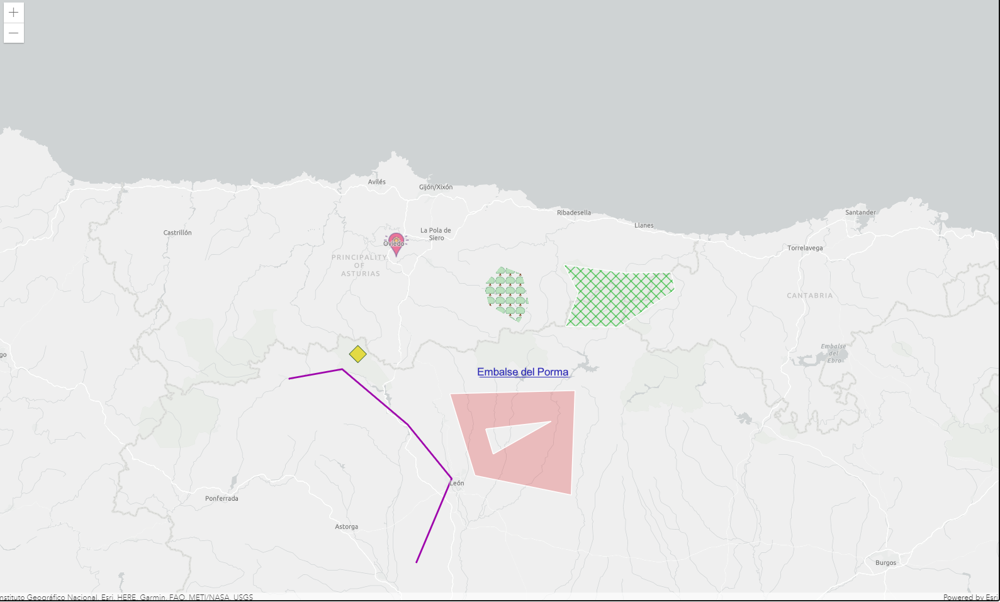
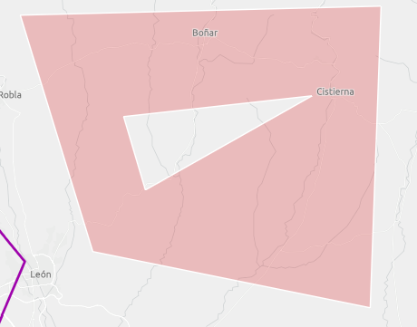
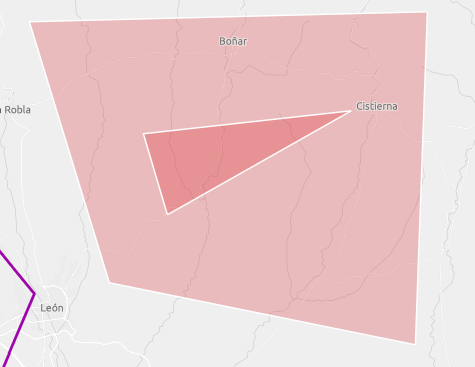

# Gráficos: añadir puntos, líneas y polígonos 



En este tutorial utilizaremos una capa gráfica para añadir diferentes gráficos como puntos, líneas y polígonos.

Para añadir gráficos necesitamos definir la localización del punto, su simbología y crear el gráfico combinándolos.

```js
// Localización
const simplePointer = {
  type: 'point',
  longitude: -6.004906,
  latitude: 43.011684
};
// Simbología
const simpleMarkerSymbol = {
  type: "simple-marker",
  style: "diamond",
  outline: { color: [34, 81, 34, 0.86] },
  size: 21,
  color: [230, 217, 40, 0.92]
};
// Gráfico: localización y simbología
const simpleMarkerGraphic = new Graphic({
  geometry: simplePointer,
  symbol: simpleMarkerSymbol
});
```

# Localización 

## 📍 Puntos
Para localizar un punto necesasitaremos su longitud y latitud.
```js
const picturePointer = {
  type: 'point',
  longitude: -5.837364,
  latitude: 43.358144
};
```

## 📈 Líneas y polilíneas
Tendremos que indicar las coordenadas de todos los puntos por los que pasará la línea en el sentido de las agujas del reloj.
```js
var polyline = {
  type: "polyline", 
  paths: [
    [-6.304283,42.933308], 
    [-5.787926,42.786338],
    [-5.749474,42.343327]
  ]
};
```

## 🔶 Polígonos
Al igual que con las polílineas, deberemos indicarle las coordenadas de los vértices del polígono en un array.
```js
var simpleFill = {
  type: "polygon",
  rings: [
    [-5.105400,43.296206],
    [-4.830742,43.270213],
    [-4.635735,43.272213],
    [-4.619255,43.216193],
    [-4.860954,43.098984],
    [-5.097160,43.100990], 
    [-5.043602,43.209187]
  ]
};
```
Cuando indicamos los vértices de un polígono en el sentido contrario a las agujas del reloj estamos deshaciendo el polígono, es decir, creando un hueco. Cada polígono irá dentro de un array y todos ellos, dentro de uno principal. 
```js
var polygon = {
  type: "polygon",
  rings: [
    [
      [-5.603218,42.886537], 
      [-5.056648,42.896599],
      [-5.073128,42.560674],
      [-5.493355,42.623356]
    ],
    [
      [-5.446663,42.773738],
      [-5.413704,42.692032],
      [-5.161018,42.796919]
    ]
  ]
};
```


Si ponemos las coordenadas en el sentido de las agujas del reloj tenemos un polígono doble.
```js
var polygon = {
  type: "polygon",
  rings: [
    [
      [-5.603218,42.886537], 
      [-5.056648,42.896599],
      [-5.073128,42.560674],
      [-5.493355,42.623356]
    ],
    [
      [-5.161018,42.796919],
      [-5.413704,42.692032],
      [-5.446663,42.773738]
    ]
  ]
};
```



# Simbología
Podemos personalizar la simbología de las distintas geometrías. Con la ayuda del [playground de ArcGIS](https://developers.arcgis.com/javascript/latest/sample-code/playground/live/) tendremos una previsualización rápida.

Se pueden crear simbología con imágenes, textos o formas geométricas. 
```js
// Textos
const textMarkerSymbol = {
  type: "text",
  text: "Embalse del Porma",
  font: { 
    size: 13, 
    decoration: "underline" 
  },
  color: [16, 19, 178, 1]
};

// Imágenes
var pictureFillSymbol = {
  type: "picture-fill",
  url: "https://img.icons8.com/offices/30/26e07f/deciduous-tree.png",
  width: 8,
  height: 8
};

// Formas geométricas
var fillSymbol = {
  type: "simple-fill",
  style: "diagonal-cross",
  color: [25, 182, 41, 1],
  outline: {
    color: [255, 255, 255],
    width: 1
  }
};
```
# Añadir gráficos al mapa
Podremos añadir todos los gráficos directamente a la capa gráfica de la vista.

```js
view.graphics.addMany([simpleMarkerGraphic, textGraphic]);
```