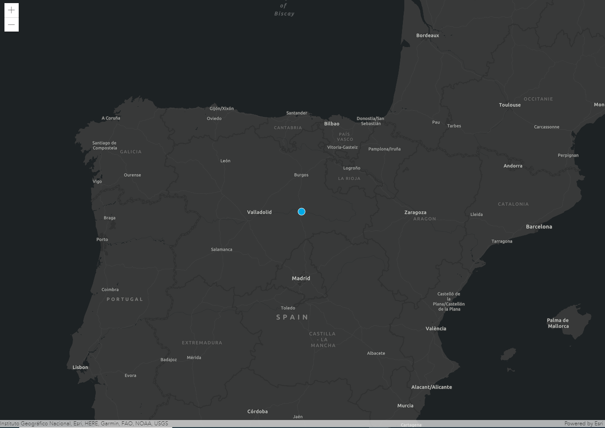

# HelloWorld! con ES6 modules


[Demo](http://esri-es.github.io/arcgis-devlabs/APIJavaScript/helloWorldES6/)

Vamos a construir un mapa y añadir un marcador utilizando la versión 4 de la [API de JavaScript](https://developers.arcgis.com/javascript/latest/) y los [ES6 modules](https://hacks.mozilla.org/2015/08/es6-in-depth-modules/).

En este repositorio también hay un [tutorial](https://github.com/esri-es/arcgis-devlabs/tree/master/APIJavaScript/helloWorld) creando el mismo mapa sin usar los ES6 modules.

La principal diferencia es el modo de carga de los módulos de la API de ArcGIS.

**Con ES6 modules**
```js
import Map from "https://js.arcgis.com/4.18/@arcgis/core/Map.js";
import MapView from "https://js.arcgis.com/4.18/@arcgis/core/views/MapView.js";
import Graphic from "https://js.arcgis.com/4.18/@arcgis/core/Graphic.js";
import GraphicsLayer from "https://js.arcgis.com/4.18/@arcgis/core/layers/GraphicsLayer.js";
```

**Con *require*** 
```js
require([ 
  "esri/Map",  
  "esri/views/MapView", 
  "esri/layers/GraphicsLayer",  
  "esri/Graphic"],  
  function ( 
    Map,  
    MapView,  
    GraphicsLayer,  
    Graphic) { 
      
    });
```
El resto del código es exactamente el mismo:
- Creación del mapa y de su vista.
- Creación del punto y su simbología.
- Añadir el punto a la capa gráfica y al mapa.