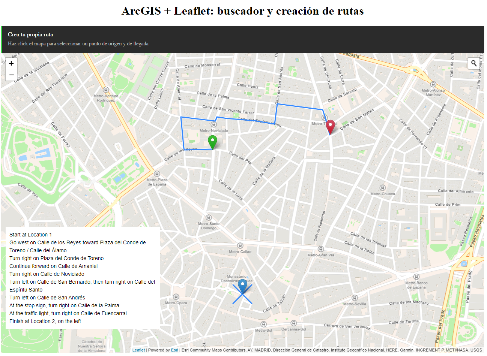
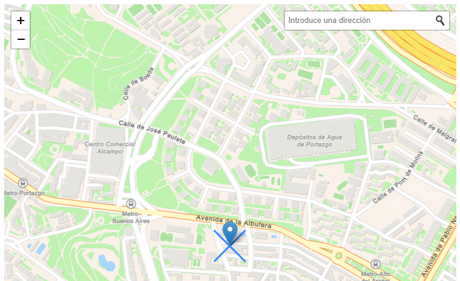

# Leaflet + ArcGIS



En este tutorial puedes ver cómo integrar [Leaflet](https://leafletjs.com/) con la tecnología de Esri usando la librería [Esri-Leaflet](https://esri.github.io/esri-leaflet/).

## Pasos
### 1. Cargamos la librería de Leaflet y la de Esri-Leaflet del CDN
```html
<!-- Load Leaflet from CDN -->
<link rel="stylesheet" href="https://unpkg.com/leaflet@1.7.1/dist/leaflet.css"/>
<script src="https://unpkg.com/leaflet@1.7.1/dist/leaflet.js"></script>

<!-- Load Esri Leaflet from CDN -->
<script src="https://unpkg.com/esri-leaflet@3.0.0/dist/esri-leaflet.js"></script>
<script src="https://unpkg.com/esri-leaflet-vector@3.0.0/dist/esri-leaflet-vector.js"></script>
```

### 2. Creación del mapa
Definimos la variable mapa asignándole el punto central y el zoom.
```js
const map = L.map('mapid', {
  center: [37.392535, -6.001902],
  zoom: 13
});
```

### 3. Asignamos un mapa base
En este caso, hemos optado por añadir un mapa base de ArcGIS. Para ello necesitamos definir la APIkey de Esri y un estilo.

>**Nota:** Puedes crear tu API key en la web de [desarrolladores de Esri](https://developers.arcgis.com/).

```js
const apiKeyEsri = 'your-api-key';
const basemapStyle = 'ArcGIS:Navigation';

L.esri.Vector.vectorBasemapLayer(basemapStyle, {
  apiKey: apiKeyEsri
}).addTo(map);
```

### 4. Buscador de localizaciones
Vamos a usar el geocodificador de [Esri Leaflet Geocoder](https://github.com/Esri/esri-leaflet-geocoder) que es una librería que nos facilita la interación con el servicio de geocodificación.

#### 4.1. Creación la caja de búsqueda y funcionalidad
Instauramos la caja de búsqueda y algunas propiedades como que haga zoom al resultado. Para poder trabajar con este geocoder necesitamos la APIkey de Esri.
```js
const searchPlaces = L.esri.Geocoding.geosearch({
  position: 'topright',
  placeholder: 'Introduce una dirección',
  useMapBounds: false,
  zoomToResult: true,
  providers: [L.esri.Geocoding.arcgisOnlineProvider({
    apikey: apiKeyEsri,
    nearby:  [40.421083, -3.705673]
  })]
}).addTo(map);
```
> **Nota:** Recuerda habilitar el servicio de geocodificación de tu API key en la [página de desarrolladores](https://arcgis.developers.com).

#### 4.2. Añade el marcador
Capturamos cuando se haya acabado la geocodificación y añadimos un marcador.
```js
searchPlaces.on('results', function(result) {
  L.marker(result.latlng).addTo(map);
});
```
También le vamos a añadir una X como marcador en esa misma posición, para ello necesitaremos cargar la librería de [Leaflet shapeMarkers](https://github.com/Esri/Leaflet.shapeMarkers) en el HTML.
```html
<!-- Load shapeMarkers from CDN -->
<script src="https://unpkg.com/leaflet-shape-markers@1.0.6"></script>
```
Y lo añadimos al mapa:
```js
searchPlaces.on('results', function(result) {
  L.marker(result.latlng).addTo(map); // Add marker to map
  L.shapeMarkers.xMarker(result.latlng, 50).addTo(map) // Add X to map
});
```


### 5. Creación de rutas
Para crear rutas, necesitamos la API REST de ArcGIS y lo primero que haremos será cargar el CDN:
```html
<!-- Load ArcGIS REST JS from CDN -->
<script src="https://unpkg.com/@esri/arcgis-rest-request@3.0.0/dist/umd/request.umd.js"></script>
<script src="https://unpkg.com/@esri/arcgis-rest-routing@3.0.0/dist/umd/routing.umd.js"></script>
<script src="https://unpkg.com/@esri/arcgis-rest-auth@3.0.0/dist/umd/auth.umd.js"></script>
```
#### 5.1. Creamos [layerGroups](https://leafletjs.com/examples/layers-control/) 
Creamos layerGroups para representar el punto inicial, final y las indicaciones de la ruta.
```js
const startLayerGroup = L.layerGroup().addTo(map);
const endLayerGroup = L.layerGroup().addTo(map);
const routeLines = L.layerGroup().addTo(map);
```
#### 5.2. Asignaremos el primer click como inicio de la ruta y el segundo como el final. 
Definimos unas variables para guardar información.
```js
let currentStep = "start";
let startCoords, endCoords;
```
Creamos diferentes estilos para los marcadores.
```js
var greenIcon = new L.Icon({
  iconUrl: 'https://raw.githubusercontent.com/pointhi/leaflet-color-markers/master/img/marker-icon-2x-green.png',
  shadowUrl: 'https://cdnjs.cloudflare.com/ajax/libs/leaflet/0.7.7/images/marker-shadow.png',
  iconSize: [25, 41],
  iconAnchor: [12, 41],
  popupAnchor: [1, -34],
  shadowSize: [41, 41]
});
var redIcon = new L.Icon({
  iconUrl: 'https://raw.githubusercontent.com/pointhi/leaflet-color-markers/master/img/marker-icon-2x-red.png',
  shadowUrl: 'https://cdnjs.cloudflare.com/ajax/libs/leaflet/0.7.7/images/marker-shadow.png',
  iconSize: [25, 41],
  iconAnchor: [12, 41],
  popupAnchor: [1, -34],
  shadowSize: [41, 41]
});
```
Asignamos los marcadores al inicio y al final de la ruta y lanzamos la creación de ruta cuando tengamos ambos puntos *updateRoute*.
```js
map.on("click", (e) => {
  const coordinates = [e.latlng.lng, e.latlng.lat];
  if (currentStep === "start") {
    startLayerGroup.clearLayers();
    endLayerGroup.clearLayers();
    routeLines.clearLayers();
    L.marker(e.latlng, {icon: greenIcon}).addTo(startLayerGroup);
    startCoords = coordinates;
    currentStep = "end";
  } else {
    L.marker(e.latlng, {icon: redIcon}).addTo(endLayerGroup);
    endCoords = coordinates;
    currentStep = "start";
  }

  if (startCoords && endCoords) {
    updateRoute();
  }
});
```
#### 5.3. Petición para crear la ruta
Como hemos dicho, la creación de rutas lo haremos usando la API REST de ArcGIS para lo cual necesitaremos tener habilitada la creación de rutas en nuestra APIkey. 

Por último, añadiremos las indicaciones al mapa modificando el DOM.
```js
const directions = document.createElement("div");
directions.id = "directions";
directions.innerHTML = "Click on the map to create a start and end for the route.";
document.body.appendChild(directions);

function updateRoute() {
  const authentication = new arcgisRest.ApiKey({
    key: apiKeyEsri
  });

  arcgisRest
    .solveRoute({
      stops: [startCoords, endCoords],
      endpoint: "https://route-api.arcgis.com/arcgis/rest/services/World/Route/NAServer/Route_World/solve",
      authentication
    })
    .then((response) => {
      routeLines.clearLayers();
      L.geoJSON(response.routes.geoJson).addTo(routeLines);

      const directionsHTML = response.directions[0].features.map((f) => f.attributes.text).join("<br/>");
      directions.innerHTML = directionsHTML;
      startCoords = null;
      endCoords = null;
    })
    .catch((error) => {
      console.error(error);
      alert("There was a problem using the route service. See the console for details.");
    });
}
```


