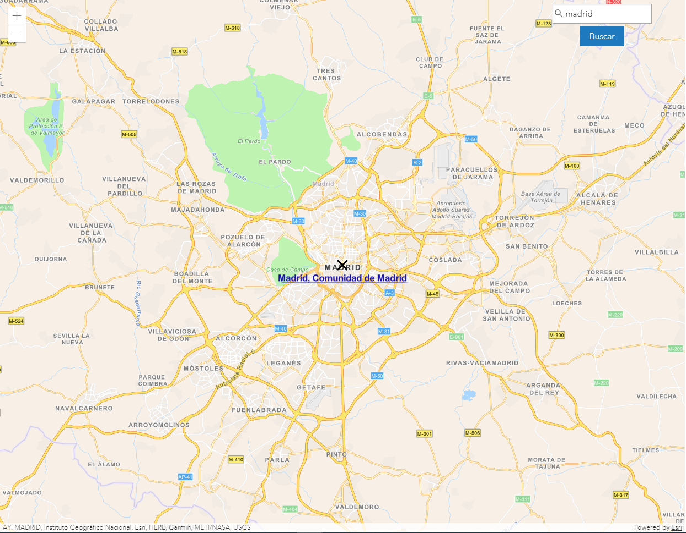

# Geocodificación de lugares



En este tutorial utilizaremos el servicio de geocodificación de la API REST de ArcGIS con la [clase Locator](https://developers.arcgis.com/javascript/latest/api-reference/esri-tasks-Locator.html) de la API de JavaScript para obtener las coordenadas de un lugar. 

Podemos obtener un resultado similar utilizando el [widget de búsqueda](https://developers.arcgis.com/javascript/latest/api-reference/esri-widgets-Search.html) aunque no podríamos personalizarlo tanto.

## Pasos

### 1. Creación y centrado del mapa
Como siempre, crearemos el mapa y centraremos la vista.
```js
const map = new Map({
  basemap: "streets-navigation-vector"
});

const view = new MapView({
  map: map,
  container: "viewDiv",
  extent: {
    xmin: -695101.3538393214,
    ymin: 5264104.536846918,
    xmax: -489791.4958652594,
    ymax: 5409640.63870195,
    spatialReference: {
      wkid: 102100
    }
  }
});
```
### 2. Caja de búsqueda
En este caso, necesitaremos añadir dos elementos más al clásico *div* que teníamos hasta ahora donde se pinta el mapa. Tenemos que añadir un input y un botón para poder realizar las búsquedas.
```html
<div id="viewDiv">
  <div class="locator">
    <input type="text" id="address" class="input-search" placeholder="Dirección">
    <button id="btnLocate" class="btn modifier-class">Buscar</button>
  </div>
</div>
```
> **Nota:** Para mejorar la interfaz hemos utilizado la librería [Calcite](https://developers.arcgis.com/calcite-design-system/) propia de Esri.

### 3. Búsqueda del lugar
* Cuando cliquemos sobre el botón, se ejecutará la función que nos devuelva el resultado.
```js
document.getElementById("btnLocate").addEventListener("click", getAddressLocation);
```
* Una vez definida la función, tenemos que obtener el valor del input y preparar los parámetros para enviarlos al geocoder.
```js
function getAddressLocation() {
  view.graphics.removeAll();

  var objAddress = {
    "SingleLine": document.getElementById('address').value
  };

  var params = {
    address: objAddress,
    outFields: ["*"]
  };
}
```
* Dentro de la misma función, definiremos la URL del servicio y lanzaremos la geocodificación usando el método [*addressToLocations*](https://developers.arcgis.com/javascript/latest/api-reference/esri-tasks-Locator.html#addressToLocations) definido en la documentación. Una vez obtenido el resultado, se ejecutará la función *showResults* que pintará el resultado.
```js
const taskLocator = new Locator("http://geocode.arcgis.com/arcgis/rest/services/World/GeocodeServer");

taskLocator
  .addressToLocations(params)
  .then(response => showResults(response));
```

### 4. Mostrar el resultado
Como hemos dicho, la función encargada de añadir el resultado el mapa será *showResults* que, concretamente, añadirá un marcador en forma de cruz y el nombre de la ubicación.

Según podemos leer en la documentación, el método *addressToLocations* nos devuelve un array de direcciones candidatas. 
* Una vez comprobado que nos ha devuelto algún resultado,seleccionamos el primer elemento del array y guardamos su localización en la variable *geometryLocation* para usarla más adelante.
```js
function showResults(candidates) { 
  let geometryLocation;
  if (candidates.length !== 0) {
    const bestCandidate = candidates[0];

    geometryLocation = bestCandidate.location;
  }
}
```
* Creamos nuestra simbología propia y la aplicamos como un gráfico. 
```js
const simpleMarkerSymbol = {
  type: "simple-marker",
  style: "x",
  outline: { width: 2 }
};

const graphicResult = new Graphic(
  geometryLocation, 
  simpleMarkerSymbol
);
```
> **Nota:** Recuerda que en este mismo repositorio hay un [tutorial](https://github.com/esri-es/arcgis-devlabs/blob/master/APIJavaScript/graphicPoint/README.md) donde se explican detalladamente los gráficos.
* Creamos la simbología que muestra el nombre del lugar y la aplicamos al mismo punto desplazándola en el eje y.
```js
const textSymbol = {
  type: "text",
  text: bestCandidate.attributes.Place_addr,
  font: { 
    size: 13, 
    decoration: "underline",
    weight: "bold" 
  },
  color: [16, 19, 178, 1],
  xoffset: 0,
  yoffset: -22
};

var textGraphicResult = new Graphic(
  geometryLocation, 
  textSymbol
);
```
* Por último, añadimos los gráficos al mapa y centramos el mapa sobre ese punto.
```js
view.graphics.addMany([graphicResult, textGraphicResult]);

view.center = [geometryLocation.longitude, geometryLocation.latitude];
view.zoom = 10;
```

## Mejoras del código
Algunas de las mejoras de código son:
1. Permitir al usuario lanzar la búsqueda al pulsar la tecla enter.
```js
const checkIfEnter = (evt) => {
  if (evt.keyCode === 13) getAddressLocation();
};

document.getElementById('address').addEventListener("keyup", checkIfEnter);
```
2. Dar una visión general del mapa cuando no se obtiene ningún resultado.
```js
if (geometryLocation === undefined) {
  view.center = [-3.769188,39.921330];
  view.zoom = 6;
};
```