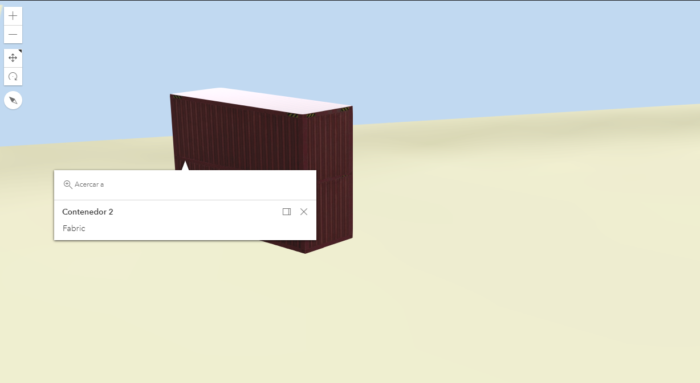

# Simbología 3D


[Demo](http://esri-es.github.io/arcgis-devlabs/APIJavaScript/pile3Dsymbols/)

En este tutorial vamos a ver cómo aplicar una simbología en 3D y apilados.

## Pasos

# 1. Crear un mapa en 3D
El procedimiento para crear un mapa en 3D es el mismo que para crear uno en 2D solo tendremos que sustituir la vista por una en 3D, es decir, por una SceneView. 

```js
const map = new Map({
  basemap: "arcgis-streets-relief"
});

const view = new SceneView({
  container: "viewDiv",
  map: map,
  camera: {
    position: {
      spatialReference: {
        latestWkid: 3857,
        wkid: 102100
      },
      x: -424954.19966221525,
      y: 5373511.091342802,
      z: 143.77535701170564
    },
    heading: 348.7768915962875,
    tilt: 66.59725442919594
  }
});
```
Como podemos ver en el código, es necesario añadir la coordenada Z así como el ángulo e inclinación de la cámara.

>**Nota:** En este post del [blog de Esri](https://www.esri.com/arcgis-blog/products/js-api-arcgis/3d-gis/arcgis-api-for-javascript-camera-intro/) está explicado mucho más en detalle cómo definir los parámetros de la cámara para encontrar el enfoque adecuado.

## 2. Definimos la localización de un contenedor
La forma de agregar los gráficos es la misma que en 2D, necesitamos un punto y un símbolo.
```js
var container1 = {
  type: "point",
  x: -3.818255,
  y: 43.406023
};

var containerSymbol = new WebStyleSymbol({
  name: "Cargo_Box", 
  styleName: "EsriRealisticTransportationStyle",
});
```
>**Nota:** Puedes ver el listado de iconos al completo [aquí](https://developers.arcgis.com/javascript/latest/visualization/symbols-color-ramps/esri-web-style-symbols-3d/)