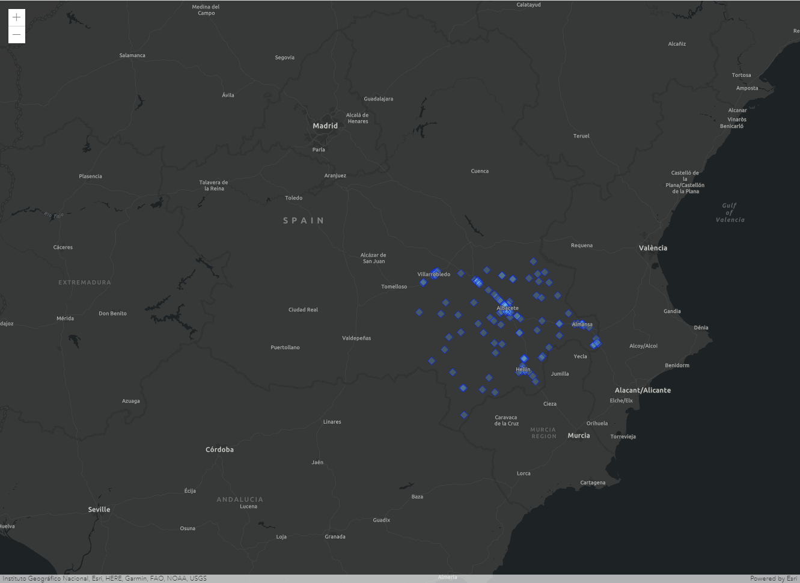
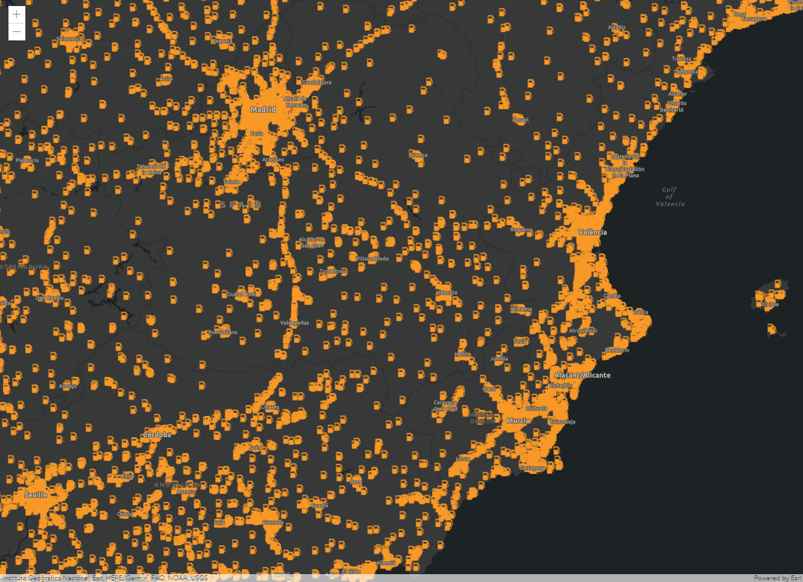
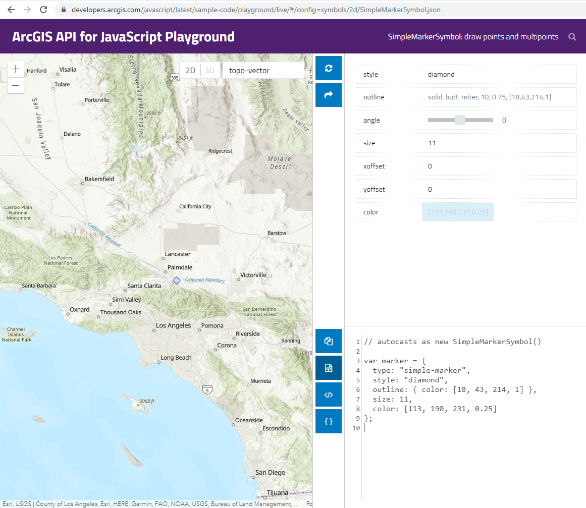
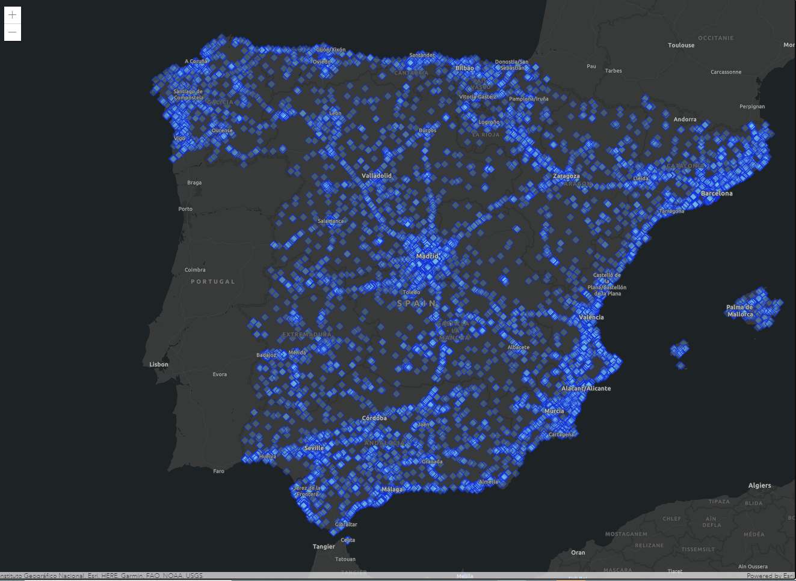

# SimpleRenderer



Este código es un ejemplo de uso de la clase [SimpleRenderer](https://developers.arcgis.com/javascript/latest/api-reference/esri-renderers-SimpleRenderer.html) que nos permite aplicar la misma simbología a todos los elementos de una capa.

Se ha utilizado una [feature layer](https://developers.arcgis.com/javascript/latest/api-reference/esri-layers-FeatureLayer.html) del [Living Atlas de Esri](https://livingatlas.arcgis.com/en/home/) que proporciona datos curados. Concretamente hemos utilizado la [capa de gasolineras](https://www.arcgis.com/home/item.html?id=1985d0ff8aa84dbc8c90189509731101) de España consumiéndola a través de su [API](https://services1.arcgis.com/nCKYwcSONQTkPA4K/arcgis/rest/services/Gasolineras_Pro/FeatureServer). 

## Pasos
1. Creamos un mapa y su vista

```js
const map = new Map({
  basemap: "dark-gray-vector"
});

const view = new MapView({
  map: map,
  container: "viewDiv",
  center: [-1.866639, 38.996464],
  zoom: 8
});
```

2. Creamos la capa de gasolineras y la añadimos al mapa. Como no hemos definido ninguna simbología, aparecerá la que tenía la capa por defecto.
```js
const gasStationLayer = new FeatureLayer({
  url: "https://services1.arcgis.com/nCKYwcSONQTkPA4K/ArcGIS/rest/services/Gasolineras_Pro/FeatureServer/0"
});

map.add(gasStationLayer);
```



3. Definimos una simbología propia con [ArcGIS Playground](https://developers.arcgis.com/javascript/3/samples/playground/index.html). Aunque podemos hacerlo sin él, es bastante útil porque tenemos una previsualización y el código de la simbología para integrarlo en nuestro código.



```js
var gasStationRenderer = {
  type: "simple", // autocasts as new SimpleRenderer()
  symbol: {
    type: "simple-marker",
    style: "diamond",
    outline: { color: [18, 43, 214, 1] },
    size: 11,
    color: [113, 190, 231, 0.25]
  }
};
```

4. Aplicamos la simbología a la capa.
```js
const gasStationLayer = new FeatureLayer({
  url: "https://services1.arcgis.com/nCKYwcSONQTkPA4K/ArcGIS/rest/services/Gasolineras_Pro/FeatureServer/0",
  renderer: gasStationRenderer
});
```



### 💡 Pro Tip!
>Para filtrar los datos tan solo tenemos que declarar una expresión a la hora de cargar la capa. En este caso hemos optado por filtrar por provincia:
```js
const gasStationLayer = new FeatureLayer({
  url: "https://services1.arcgis.com/nCKYwcSONQTkPA4K/ArcGIS/rest/services/Gasolineras_Pro/FeatureServer/0",
  renderer: gasStationRenderer,
  definitionExpression: "PROVINCIA = 'ALBACETE'"
});
```
>Puedes ver todos los campos disponibles en la [documentación del servicio](https://services1.arcgis.com/nCKYwcSONQTkPA4K/ArcGIS/rest/services/Gasolineras_Pro/FeatureServer/0). 