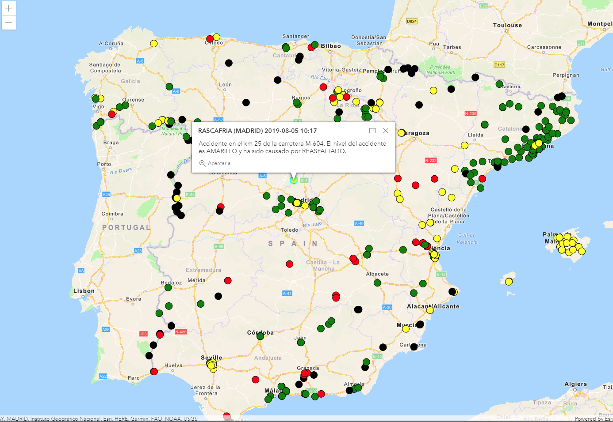

# Unique Value Renderer y popups



En este tutorial se implementa el uso de la clase [UniqueValueRenderer](https://developers.arcgis.com/javascript/latest/api-reference/esri-renderers-UniqueValueRenderer.html) que nos permite asignar una simbología en función del valor de un campo cualitativo. En este caso, se ha asignado una simbología distinta para los diferentes niveles de gravedad de los accidentes. Los datos los hemos obtenido de [ArcGIS Online](https://www.arcgis.com/home/search.html?q=).

## Pasos
1. Definición del mapa y su vista.
```js
const map = new Map({
  basemap: "streets-navigation-vector"
});

const view = new MapView({
  map: map,
  container: "viewDiv",
  center: [-3.7032700, 40.4166400],
  zoom: 6
});
```

2. Creamos la capa y la añadimos al mapa.
```js
const roadAccidentsLayer = new FeatureLayer({
  url: "https://services1.arcgis.com/nCKYwcSONQTkPA4K/ArcGIS/rest/services/incidencias_DGT/FeatureServer/0",
  renderer: levelRenderer,
});

map.add(roadAccidentsLayer);
```

3. El renderizado será de tipo *unique-value* y el [campo](https://services1.arcgis.com/nCKYwcSONQTkPA4K/ArcGIS/rest/services/incidencias_DGT/FeatureServer/0) que queremos representar es *nivel*, es decir, representaremos los diferentes niveles de gravedad de las incidencias. A continuación, declaramos la simbología por defecto y la simbología para cada valor que toma el campo *nivel*.
```js
const levelRenderer = {
  type: "unique-value",
  field: "nivel",
  defaultSymbol: { type: "simple-marker", color: "pink"},
  uniqueValueInfos: [
    {
      value: "VERDE", 
      symbol: {
        type: "simple-marker",
        color: "green"
      }
    },
    {
      value: "ROJO", 
      symbol: {
        type: "simple-marker",
        color: "red"
      }
    },
    {
      value: "NEGRO", 
      symbol: {
        type: "simple-marker",
        color: "black"
      }
    },
    {
      value: "AMARILLO", 
      symbol: {
        type: "simple-marker",
        color: "yellow"
      }
    },
  ]
};
```


4. Añadimos el renderizado a la capa.
```js
const roadAccidentsLayer = new FeatureLayer({
  url: "https://services1.arcgis.com/nCKYwcSONQTkPA4K/ArcGIS/rest/services/incidencias_DGT/FeatureServer/0",
  renderer: levelRenderer
});
```

5. Mejoraremos la experiencia de usuario añadiendo un popup con información sobre la incidencia. Definiremos la información a mostrar en la propiedad [*popupTemplate*](https://developers.arcgis.com/javascript/latest/api-reference/esri-layers-FeatureLayer.html#popupTemplate) de la [feature layer](https://developers.arcgis.com/javascript/latest/api-reference/esri-layers-FeatureLayer.html).
```js
const roadAccidentsLayer = new FeatureLayer({
  url: "https://services1.arcgis.com/nCKYwcSONQTkPA4K/ArcGIS/rest/services/incidencias_DGT/FeatureServer/0",
  renderer: levelRenderer,
  outFields: ["*"],
  popupTemplate: {
    title: "{poblacion} ({provincia}) {fechahora_}",
    content: "Accidente en el km {pk_inicial} de la carretera {carretera}. El nivel del accidente es {nivel} y ha sido causado por {causa}."
  }
});
```