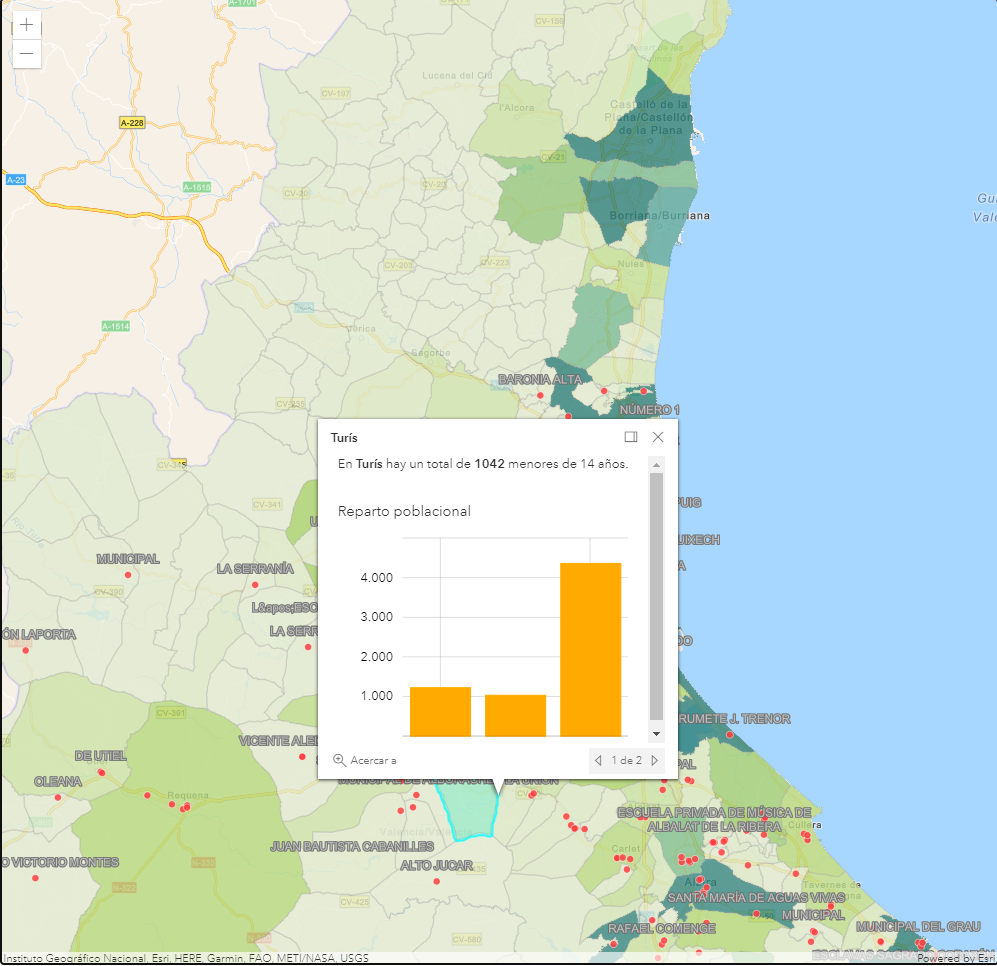
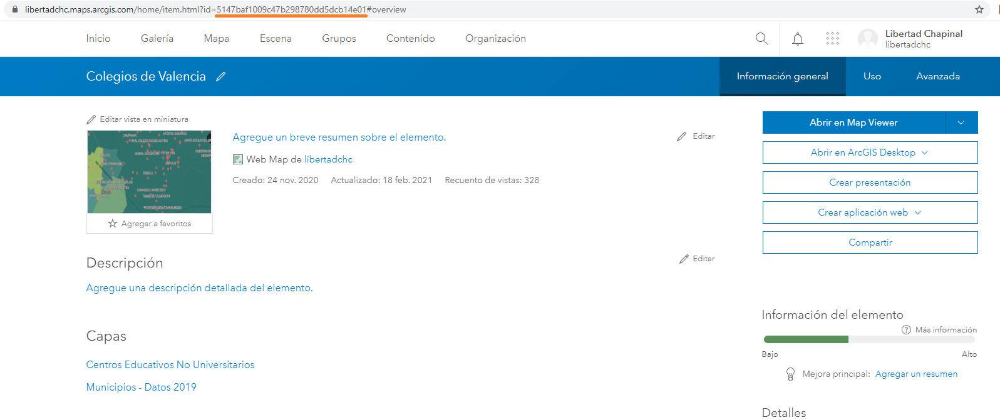
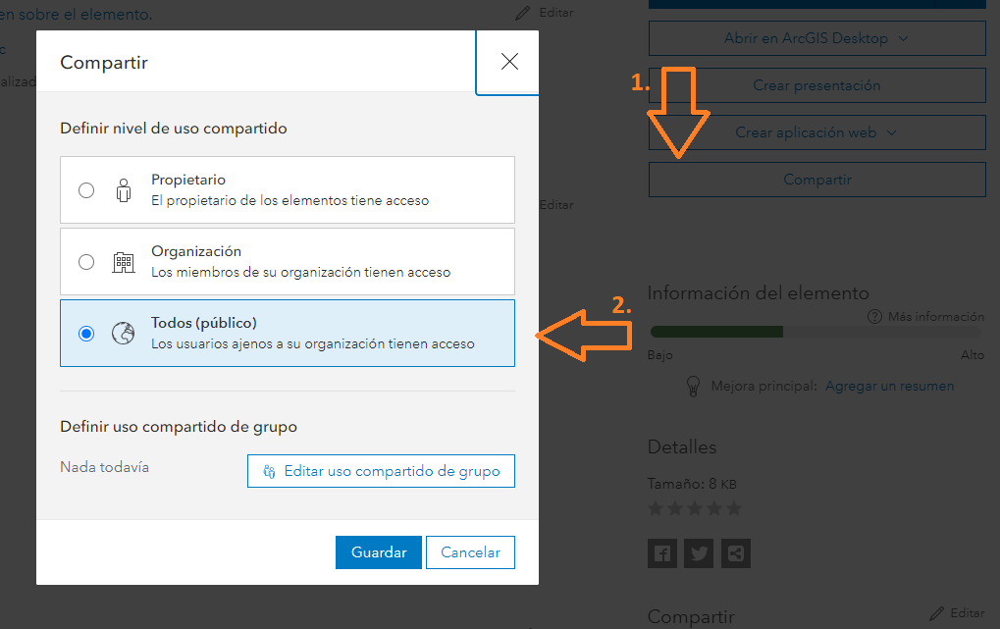

# Usando webmaps



Vamos a añadir un webmap utilizando la API de JavaScript para aprovechar toda la potencialidad de [ArcGIS Online](https://www.arcgis.com/home/index.html), de forma que tengamos la misma simbología y popups definidos en el MapViewer.

Una vez tengamos creado un webmap en ArcGIS Online, tendremos que usar su identificador único que podemos ver en la URL del elemento.



> **Nota:** Para no tener que estar poniendo nuestro usuario y contraseña puedes hacer el elemento público siguiendo estos pasos.
> 


## Pasos
1. Para añadir un webmap necesitaremos los módulos de MapView y Webmap.

```js
import MapView from "https://js.arcgis.com/4.18/@arcgis/core/views/MapView.js";
import WebMap from "https://js.arcgis.com/4.18/@arcgis/core/WebMap.js";
```

2. Crear un webmap utilizando el id que hemos obtenido de la URL

```js
const webmap = new WebMap({
  portalItem: {
    id: "5147baf1009c47b298780dd5dcb14e01"
  }
});
```

3. Vamos a añadir un mapa base al webmap.
```js
webmap.basemap = "streets-navigation-vector";
```

4. Centraremos la vista del mapa y lo añadiremos al div del HTML
```js
const view = new MapView({
  map: webmap,
  container: "viewDiv",
  center: [-0.387833, 39.473387],
  zoom: 10
});
```